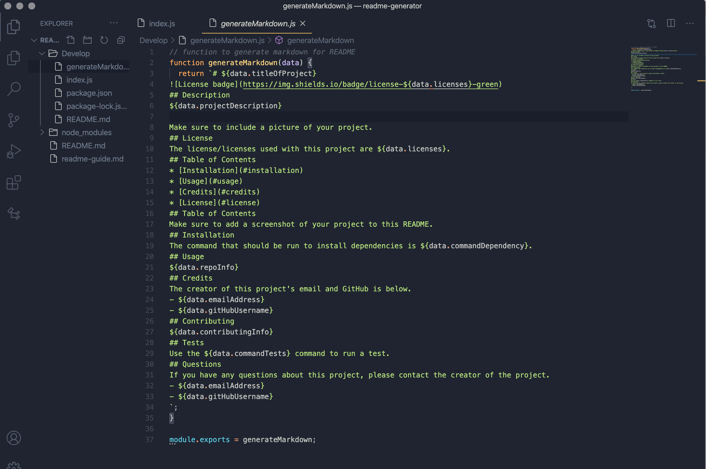

# README Generator
When creating an open source project on GitHub, it’s important to have a high-quality README for the app. This should include what the app is for, how to use the app, how to install it, how to report issues, and how to make contributions—this last part increases the likelihood that other developers will contribute to the success of the project.

You can quickly and easily generate a README file by using a command-line application to generate one. This allows the project creator to devote more time working on the project.

**Link to GitHub Repo:** https://github.com/rachealcolbert/readme-generator

**Screenshot of Application:** 

## Description 
This is a command-line application that dynamically generates a professional README.md file from a user's input using the Inquirer package. The README includes the title of the project, a description, table of contents, installation instructions, how to use the project, the licenses with the project, contributing notes, and the project creator's information. 

The application will be invoked by using the following command: **node develop/index.js**

## Table of Contents
* [Installation](#installation)
* [Usage](#usage)
* [Credits](#credits)
* [License](#license)
## Installation
The command that should be run to install dependencies is npm i.
## Usage 
To invoke the application, use the command **node develop/index.js** in the terminal. 
## Credits
The creator of this project's email and GitHub is below. 
- [GitHub](https://github.com/rachealcolbert)
- rachealcolbert16@gmail.com
## Contributing
No contributions are needed on this project. 

